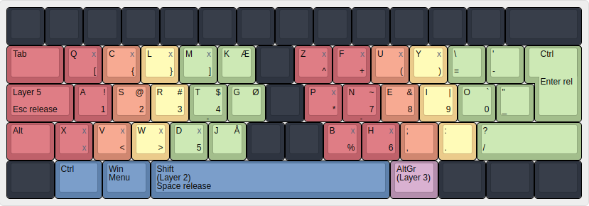
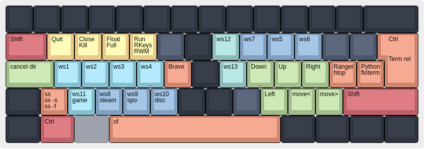

# gfkl/wokmok
gfkl/wokmok is a keyboard layout that I have created and use as my daily driver. It is intended to make it very comfortable to type both regular english and programming languages. Furthermore, it is the basis for which I attempt to find ways to do as much as possible on a computer without using the mouse. The layout is built for a 60% keyboard layout (or smaller), and whilst typing I never have to move my hands away from their positions to do anything. I currently do not own an ortholinear keyboard, but all design choices are made such that they also fit with ortholinear keyboards. I created the images with [this website](http://www.keyboard-layout-editor.com/)

### Contents
* [Current version](#current-version)
* [gfkl](#gfkl)
* [Layer 5](#layer-5)
* [Wokmok](#wokmok)
* [Analysis of Wokmok](#analysis)
* [Usage with window manager](#usage-with-window-manager)

## Current version
The color of a button indicates which finger I use to press that button. Black keys are keys that I do not like to press and they have therefore been disabled.

## gfkl
gfkl refers to any change I have done compared to the original US keyboard layout that is not concerned with the letters. For the layout of the letters see [Wokmok](#wokmok). Many of the changes have been inspired by DreymaR's [Big Bag of Tricks](https://dreymar.colemak.org/). The following changes from a regular keyboard layout have been made.
* Any key that the right hand presses have been moved once to the right. Therefore, the distance from the edge of the keyboard to the right hand is equal to the distance from the edge of the keyboard to the left hand. This makes it way more comfortable to press enter, backspace and rshift. It also makes it easier to utilize the altgr button.
* The numbers have been moved to the home row, such that they are easy to press. They are activated using the altgr button (layer 3). The slight annoyance by having to press altgr before typing numbers, is by far outweighed by the fact that the numbers are now at home row.
* All characters (except for a few) other than letters and numbers are positioned such that they are independent of whether layer 3 is currently activated. This makes the annoyance of having to use altgr even smaller.
* Due to the position of numbers and other characters, layer 1 and 2 is used exclusively for typing letters and characters that are useful for writing english and programming. Layer 3 and 4 is used exclusively for typing numbers and characters that are useful for writing math and programming. The mental overhead for switching with the altgr button is minimal, because a lot of characters are placed in the same position independently of whether altgr is currently pressed.
* The lshift key have been moved to the tab key, such that I can type with a straight wrist. If lshift is just pressed it acts as a regular tab key. By typing with a straight wrist, it is very difficult to use a finger for pressing ctrl. Therefore, I press lctrl with the bone that connects the little finger to the hand. It would be desirable to have a keyboard where ctrl can be mapped to a thumb key.
* What used to be the caps lock key now acts as a modifier for layer 5. If the button is just pressed it acts as esc.

## Layer 5
This layer is very nice. It is also inspired by DreymaR's [Big Bag of Tricks](https://dreymar.colemak.org/). The '^' signalizes that the key is sent with the ctrl modifier enabled.

* The green keys on the right hand are arrow keys that enables me to easily move around the cursor, both regularly and by word (particularly if using something that does not support vim keybinds).
* The orange keys on the right hand allow me to delete stuff, both regularly and by word.
* The yellow keys on the right hand are simply nice to have, even though I rarely use them.
* The green keys on the left hand allow me to control the tabs of web browsers.
* The yellow keys on the left hand are used for controlling audio.
* The orange keys on the left hand are used for sending commonly used shortcuts that use the ctrl modifier. Thus, I rarely have to use the ctrl modifier, which is annoying to press, because I type with a straight wrist.
* Lastly, when also holding down the altgr button, layer 7 is activated which simply contains f-keys at home row positions.

## Wokmok
Wokmok refers to the placement of the letters in the layout. Wokmok has been through several iterations and for the latest iteration, it is essentially a modification of the magnificent [ISRT](https://notgate.github.io/layout/) keyboard layout. Wokmok was originally based on a combination of [Colemak](https://colemak.com/) and [Workman](https://workmanlayout.org/) (which is kinda how the name came to be). I had tried learning both of them but had a few minor issues with them. I combined the features that I liked from both layouts (that are still present in the current iteration), and tried different combinations of the lesser frequent keys. The asrtneio keys have always been in their current location. At last, I found the by far best configuration of letters I had tried for my personal taste, simply by swapping the 'i' and 'a' columns in the ISRT layout and by moving the punctuation characters back to their original positions.

## Analysis
I tested the wokmok layout using the [DH analyzer](https://colemakmods.github.io/mod-dh/analyze.html) and the [stevepanalyzer](https://colemakmods.github.io/mod-dh/analyze.html). Wokmok generally scores slightly better than Colemak, and slightly worse than the ISRT layout. For more details, see the images inside the analyzer folder. For a detailed analysis of how the ISRT layout compares to various Colemak layouts see [this](https://notgate.github.io/layout/).

## Usage with window manager
I currently use [bspwm](https://github.com/baskerville/bspwm), and control it with the following keybinds:

