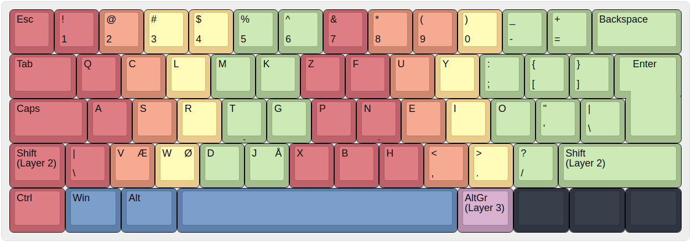

# gfkl/wokmok
gfkl/wokmok is a keyboard layout that I have created and use as my daily driver. It is intended to make it very comfortable to type both regular english and programming languages. Furthermore, it is the basis for which I attempt to find ways to do as much as possible on a computer without using the mouse. I currently do not own an ortholinear keyboard, but all design choices are made such that they also fit with ortholinear keyboards. 

### Contents
* [Current version](#current-version)
* [Wokmok](#wokmok)
* [gfkl](#gfkl)
* [Layer 5](#layer-5)
* [Usage with window manager](#usage-with-window-manager)

## Current version
The color of a button indicates which finger I use to press that button. Black keys are keys that I do not like to press and they have therefore been disabled.

## Wokmok
Wokmok refers to the placement of the letters in the layout. Thus, for a standard US keyboard layout, but with Wokmok, the layout would look something like this:

Wokmok has been through several iteration, and for the latest iteration it is essentially a modification of the magnificent [ISRT](https://notgate.github.io/layout/) keyboard layout. Wokmok was originally based on a combination of [Colemak](https://colemak.com/) and [Workman](https://workmanlayout.org/) (which is kinda how the name came to be). I had tried learning both of them but had a few minor issues with them. I combined the features that I liked from both layouts (that are still present in the current iteration), and tried different combinations of the lesser frequent keys. The asrtneio keys have always been in their current location. At last, I 

## gfkl

## Layer 5

## Usage with window manager

## Analysis

## Installation
